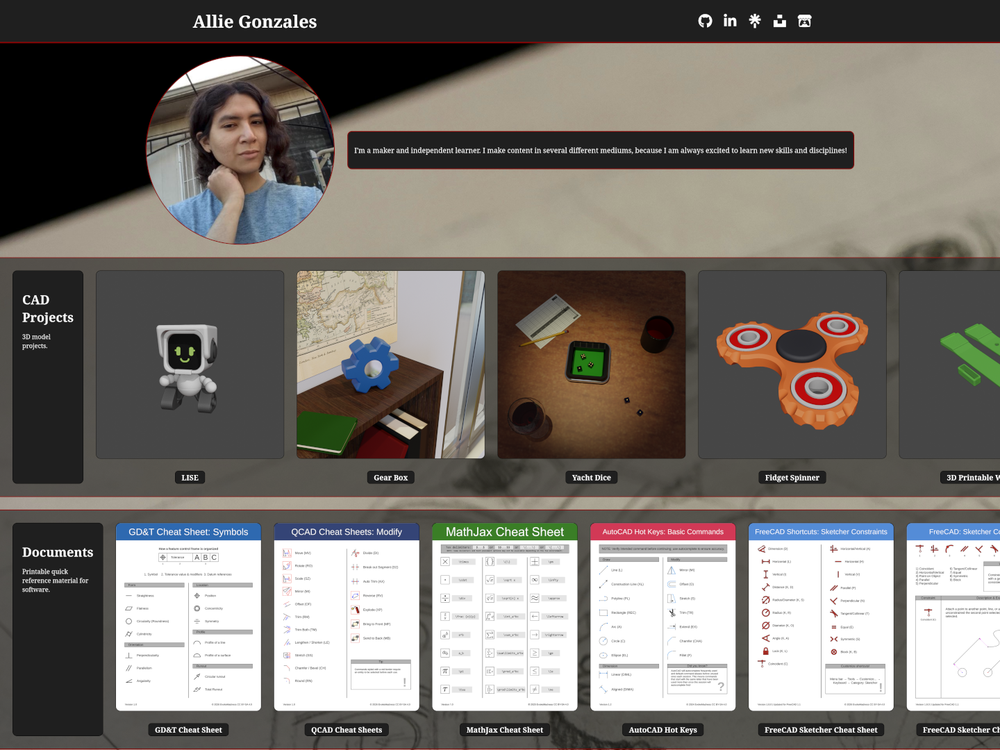
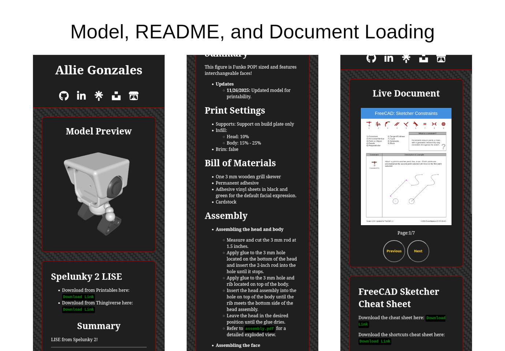

# EvokeMadness.com

- Visit my site here: [`evokemadness.com`](https://evokemadness.com/)

## Summary

My personal site, which I use as my portfolio. It is hosted on [GitHub Pages](https://docs.github.com/en/pages) and built using [eleventy](https://github.com/11ty/eleventy).

It features loading for models using [X3DOM](https://www.x3dom.org/), README files using [CommonMark](https://commonmark.org/), and documents using [PDF.js](https://mozilla.github.io/pdf.js/).

- **Other features include:**
	- Centralized config with array for site metadata and header icons.
		```
		title: "/* Full Name */ | Portfolio",
		url: "",
		language: "en",
		description:
		  /* Bio */
		author: {
		  name: "/* Author Name */",
		  username: "/* Username */",
		  email: "/* Email */",
		   links: [
		    {
		      link: "/* Link */",
		      icon: "/* Icon Link */",
		    },
		  ],
		},
		```

* * *

# Previews




